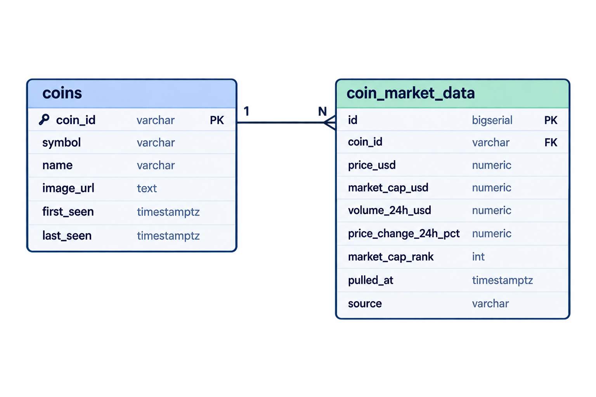
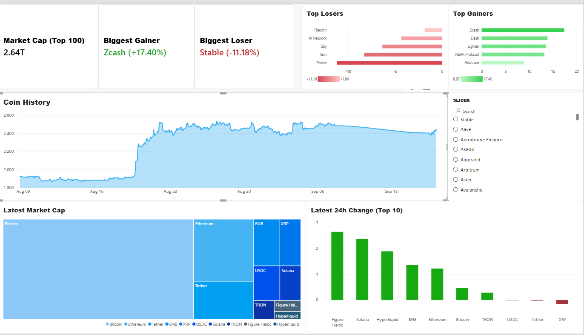

# Crypto Market Data Pipeline & Dashboard

A live cryptocurrency data pipeline tracking the top 100 coins by market cap — from raw API ingestion, through a normalized Postgres schema, to a public, auto-refreshing dashboard. Originally prototyped in Power BI, rebuilt in Streamlit once Power BI's free tier proved incompatible with "public + live + no sign-in" hosting.

**Live dashboard:** [coingecko-etl-dashboard](https://coingeck-etl-dashboard.streamlit.app/)

---

## Architecture

```
CoinGecko API
      │
      ▼
Python pipeline (upsert + snapshot + backfill logic)
      │
      ▼
Postgres (Neon) — two-table star schema
      │
      ├──► Power BI (prototype — Import mode, manual refresh)
      │
      └──► Streamlit (production — live query on every page load)
```

**Automation:** GitHub Actions runs the pipeline on a schedule. Because GitHub's own internal cron scheduler proved unreliable on this repo (scheduled runs simply didn't fire for hours at a time), the schedule is actually driven externally — cron-job.org calls GitHub's `workflow_dispatch` API endpoint every 30 minutes, which triggers the workflow reliably regardless of GitHub's native cron engine.

---

## Database design

### Entity-relationship diagram



### Why two tables, not one

`coins` is a slow-changing dimension — a coin's name, symbol, and logo almost never change. `coin_market_data` is a fast-growing fact table — a new row every pull, per coin. Collapsing these into one table would mean re-storing static metadata (name, image URL) on every single time-series row, which is both wasted storage and the wrong shape for the tool consuming it downstream: both Power BI and Streamlit/pandas work naturally with a dimension-plus-fact structure, since it maps directly onto a join (`coin_id` as the foreign key) rather than a denormalized flat table.

### The `source` column

`coin_market_data` is fed by two genuinely different processes: a live snapshot pulled every run, and a one-time historical backfill pulled from CoinGecko's `market_chart` endpoint when a coin is first seen. These two sources don't return the same fields — `market_chart` gives price, market cap, and volume with a historical timestamp, but nothing equivalent to `price_change_24h_pct` or `market_cap_rank`, since those are inherently "current-moment" figures. Rather than forcing backfilled rows to fake those fields, they're left `NULL`, and a `source` column (`'live'` / `'backfill'`) marks which kind of row it is — so any query relying on those fields knows to filter to `source = 'live'` first.

### Constraints that make bad data impossible, not just unlikely

- `coin_market_data.coin_id` is a foreign key against `coins.coin_id` — a market data row can never reference a coin that doesn't exist.
- `UNIQUE (coin_id, pulled_at, source)` — prevents duplicate rows if the pipeline is accidentally run twice for the same moment, or if backfill is accidentally re-run for an already-backfilled coin.
- A composite index on `(coin_id, pulled_at)` — every meaningful query filters by coin first, then ranges over time, so the index is ordered to match that access pattern rather than an arbitrary column order.

---

## The pipeline: API → Python → Postgres

### Endpoints used

- **`coins.markets.get(vs_currency="usd", order="market_cap_desc", per_page=100)`** — the "parent call." Returns the current top 100 coins by market cap, with price, market cap, volume, rank, and 24h change all in one response. This single call defines "which coins" the entire pipeline tracks on a given run — no hardcoded coin list, so the tracked set adjusts automatically as rankings shift.
- **`coins.market_chart.get(id=coin_id, vs_currency="usd", days=30)`** — returns ~30 days of historical price/market cap/volume as `[timestamp, value]` arrays, used once per coin to backfill history so the dashboard isn't empty on a coin's first appearance.

### `run_pipeline()` execution order

1. **Fetch the current top 100** via `coins.markets.get()`. This is the single source of truth for "which coins exist" on this run.
2. **Upsert `coins`** — insert new coins, update existing ones' `last_seen` timestamp and any changed metadata, via `INSERT ... ON CONFLICT (coin_id) DO UPDATE`.
3. **Insert the live snapshot** — every coin from step 1 gets one new row in `coin_market_data` with `source = 'live'`, timestamped using CoinGecko's own `last_updated` field per coin (not a single shared "now" for the whole batch) — deliberately, since different coins' prices genuinely update at different real-world moments, and using each coin's true update time is more accurate for time-series analysis than forcing every coin in a batch to share one artificial timestamp.
4. **Check which coins still need backfilling** — one query pulls every `coin_id` that already has a `source = 'backfill'` row, then a Python-side set difference finds which of today's top 100 are missing history. This avoids re-querying the database once per coin, and avoids ever re-backfilling a coin that's already been done.
5. **Backfill only the missing coins** — loop over that (usually short, often empty) list, calling `market_chart`, converting millisecond epoch timestamps to proper datetimes, and batch-inserting all ~720 points per coin in one call. A rate-limit pause between calls keeps the loop safely under CoinGecko's 100 calls/minute cap, and a try/except per coin means one failed call doesn't crash the run — that coin simply gets picked up again on the next scheduled run.

### Batched inserts, not row-by-row

Every insert step uses `psycopg2.extras.execute_values()` rather than looping `cur.execute()` once per row — for 100 coins or ~720 backfill points, that's the difference between one round-trip to the database and one-hundred-plus.

---

## Phase 1: Power BI (prototype)

The first working dashboard was built in Power BI, connected to Neon via its Postgres connector. It surfaced a few problems worth documenting, since they shaped the eventual switch to Streamlit:

- **Relationship direction matters for DAX.** A single-direction relationship (`coins` → `coin_market_data`) means a filter on `coin_market_data` doesn't automatically narrow `coins` — `RELATED()` or `ALLEXCEPT()`-based patterns are needed to pull dimension data back onto a filtered fact-table calculation, rather than relying on `SELECTEDVALUE()` to "just work."
- **"Correct by coincidence" measures.** With only one live snapshot per coin in the data, `AVERAGE`, `MAX`, and "latest" all produced identical results — masking bugs that only became visible once multiple live snapshots existed. Every "current value" measure had to be rewritten to explicitly find the latest `pulled_at` per coin, not aggregate across all history.
- **Free-tier hosting doesn't support this project's goals.** Power BI's Publish to Web requires a work/school account (blocking a personal-account user from publishing at all) and only supports static Import-mode data, not a live connection. Scheduled refresh against an external Postgres source requires a paid Pro license. There's no free-tier combination of "public," "no viewer sign-in," and "live data" available in Power BI — which is what motivated the move to Streamlit.

- 

---

## Phase 2: Streamlit (production)

The dashboard queries Postgres directly on every page load — no import step, no refresh button, genuinely live.

- **Two cached layers.** `@st.cache_resource` holds the database connection object across reruns (Streamlit reruns the entire script on every user interaction, so without this, a new connection would open on every click). `@st.cache_data(ttl=60)` caches query *results* for a short window, so identical queries within that window don't re-hit the database.
- **Connection health checks.** Neon's serverless Postgres drops idle connections after a period of inactivity. Before any query, a lightweight `SELECT 1` check confirms the cached connection is still alive, transparently reconnecting if not — otherwise a long-idle app would throw `psycopg2.InterfaceError` on the next interaction.
- **`DISTINCT ON` for "latest per coin."** The same "average vs. latest" problem from the Power BI phase reappears in SQL, solved more cleanly here: `SELECT DISTINCT ON (coin_id) ... ORDER BY coin_id, pulled_at DESC` returns exactly one row per coin — whichever has the most recent timestamp — in a single query, no post-processing needed.
- **Row-click navigation.** Clicking a coin in the main table stores its data in `st.session_state` and switches to a per-coin detail page (Streamlit's multi-page app structure), which then runs a second, narrower query for just that coin's price history.
- **Query scope discipline.** Every query pulls only the columns actually used downstream — summary stats (total market cap, biggest gainer/loser) are computed in pandas from data already fetched for the main table, rather than issuing separate database calls for each.

---

## Stack

- **Ingestion:** Python, `coingecko-sdk`
- **Database:** PostgreSQL (Neon, serverless)
- **Prototype dashboard:** Power BI
- **Production dashboard:** Streamlit
- **Automation:** GitHub Actions (`workflow_dispatch`) + cron-job.org (external scheduler)
- **Hosting:** Streamlit Community Cloud

